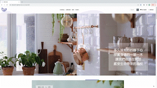
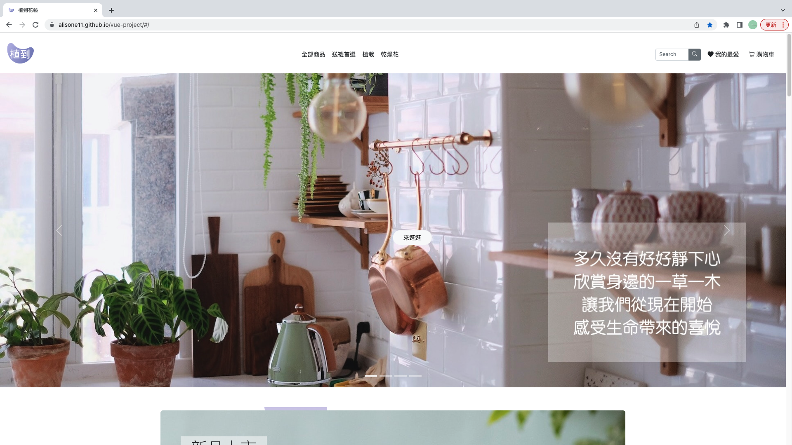
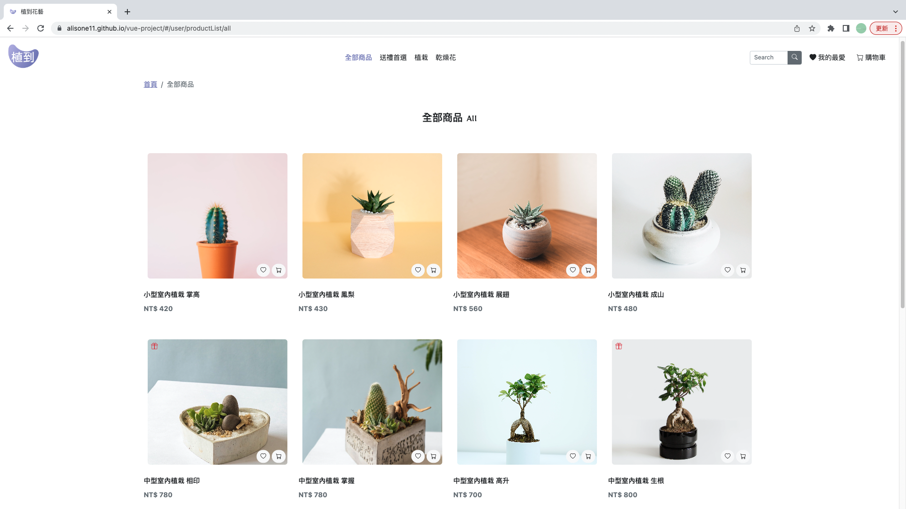
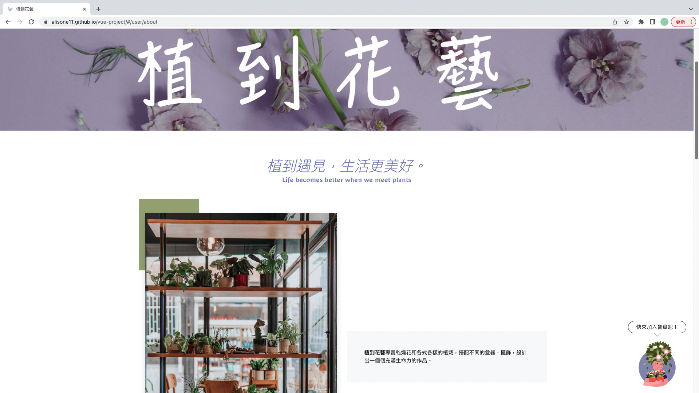
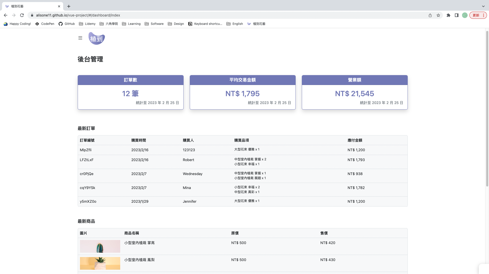

# 電商網站：植到花藝
以 Vue3 製作的 SPA 網站，有搜尋商品、加入購物車以及後台管理等功能，自行設計 UI / UX、切版，搭配 Bootstrap，響應式設計，注重使用者體驗。  
[Live Demo](https://alisonhuu.github.io/E-commerce-website/#/)  
   

## 實作
* 透過 Axios 串接 API
* 透過 Cookie 儲存 token 做登入機制
* 透過 LocalStorage 儲存我的最愛
* 透過 Vee-validate 做驗證功能
* 使用 CSS animate 和偽元素製作圖片邊框動畫
* scroll 事件使用 debounce 函式來優化效能
* 使用顏色變化、縮放、遮罩等來創造動態效果，增加使用者體驗
* 使用互動視窗（訂閱電子報）、圖片滑入（成為新會員）、banner 輪播等達到行銷效果

## 內容
包括：商品介紹 / 我的最愛 / 購物車 / 常見問題 / 關於我 / 404錯誤頁面 等等，共有前台 15 個頁面加後台管理 5 個頁面。

首頁

  

全部商品  

  

關於我  

  

後台管理  

 
